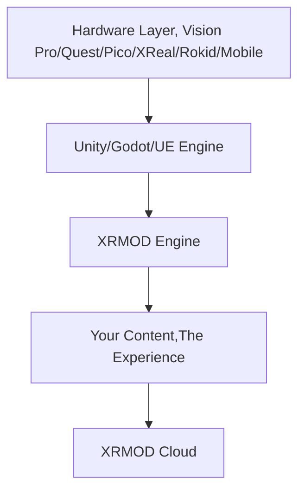

**The Infinite Canvas for Spatial Computing**
> "We are not building a walled garden. We are giving you the geology map and saying: 'Go, this land is free. Build your
> own empire.'"

# 📖 Introduction

XRMOD is not just an engine; it is an Invisible OS for the Spatial Web.

The current state of XR development is broken. Users shouldn't have to download a 500MB app for a 5-minute interaction.
Developers shouldn't be locked into centralized app stores.

XRMOD bridges the gap between the robust rendering power of Unity and the instant accessibility of the Web. It kills the
installation bar, eliminates build times, and democratizes content distribution.

With XRMOD, you don't publish Apps. You publish Experiences.

# 🚀 Core Philosophy

## The Death of the "App Island" (Instant Experience)

XRMOD acts as a Transmission Framework. It separates the logic from the content.

- Zero-Install: Users access content instantly. No APKs, no IPAs.

- Dynamic Loading: Leveraging an advanced asset streaming architecture, experiences are loaded on-demand, just like a
  webpage.

- Hot Updates: Push changes to your users instantly without app store reviews.

## Power to the People (Decentralized Ecosystem)

We believe in the democratization of the Spatial Web. XRMOD is fully open-source and free.

- Be Your Own Platform: Deploy your own content server. Create your own specialized "App Store" for vertical markets (
  Education, Gaming, Enterprise).

- Roblox-like Capability: Use XRMOD as a bottom-layer driver to allow your users to create content within your
  framework.

- No "Tax": You own t[README.zh.md](README.zh.md)he user. You own the data. You own the monetization.

## The Universal Language (Write Once, Flow Everywhere)

Stop porting code endlessly. XRMOD provides a unified abstraction layer.

- Hardware Agnostic: Whether it's Apple Vision Pro, Meta Quest, or a mobile phone, XRMOD translates your intent.

- Unified API: Develop logic once in Unity, and let XRMOD handle the underlying SDK differences.

# 🛠 Architecture

XRMOD sits between the Native Device SDKs and your Content:

