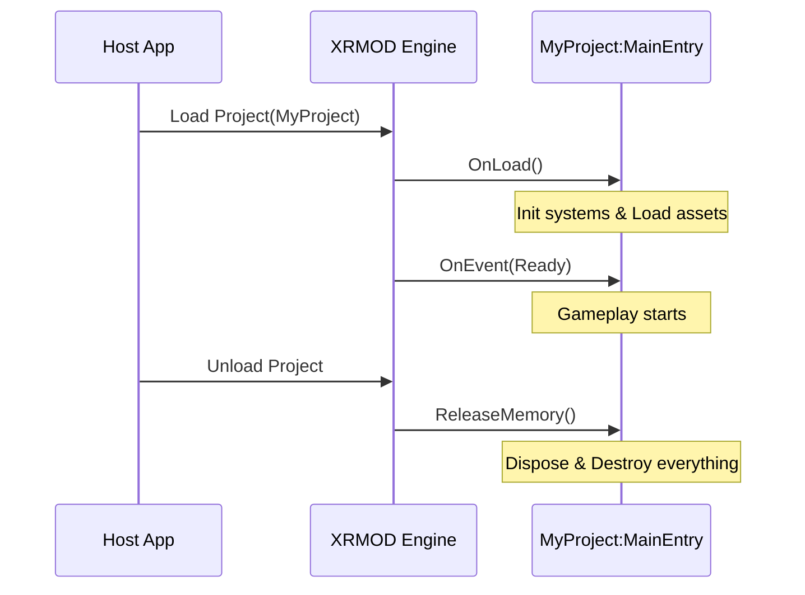

# XRMOD Foundation

The architectural heart of the XRMOD SDK, providing a high-performance, decoupled foundation for immersive XR experiences. It encapsulates core lifecycle management, asset loading, localization, and cross-platform utilities.

---

## � Table of Contents
1. [Introduction](#-introduction)
2. [For Content Creators (User View)](#-for-content-creators-user-view)
3. [For SDK Developers (Architect View)](#-for-sdk-developers-architect-view)
4. [Core Modules Overview](#-core-modules-overview)
5. [Optimization & Best Practices](#-optimization--best-practices)
6. [Installation & Dependencies](#-installation--dependencies)
7. [License](#-license)

---

## 🚀 Introduction

XRMOD Foundation is the bedrock of the XRMOD ecosystem. It manages the lifecycle of XR experiences, providing a standardized way to load content, interact with tracking algorithms (SLAM, Image Tracking, VPS), and communicate between modules via a decoupled notification system.

By integrating high-performance CLR bindings ([UnityFusion](https://github.com/PhantomsXR/UnityFusion)), it ensures stable frame rates and minimal GC overhead even in complex scenes.

---

## 🍏 For Content Creators (User View)

In XRMOD, your experience doesn't start from a generic `MonoBehaviour.Start()`. Instead, it begins with the **Main Entry** lifecycle.

### 1. The Experience Lifecycle: `MainEntry`

Your primary logic must inherit from `MainEntry`, which acts as the bridge between the XRMOD Engine and your world.



#### Core Lifecycle Methods:
- **`OnLoad()`**: Called once. Ideal for registering services and loading primary assets via `XRMODAPI`.
- **`OnEvent(BaseNotificationData data)`**: The primary channel for external signals (UI buttons, Host App commands).
- **`ReleaseMemory(string projectName)`**: **CRITICAL!** You must manually destroy objects and unsubscribe from events here to prevent memory leaks between project sessions.

### 2. Common Usage Examples

#### 📦 Loading Assets
Always use the `API` class for asset management to ensure compatibility with XRMOD's dynamic bundle system.

```csharp
using Phantom.XRMOD.XRMODAPI.Runtime;

public override void OnLoad() {
    var xrApi = new API("MyProject");
    // Load a prefab asynchronously
    GameObject player = await xrApi.LoadAssetAsync<GameObject>("PlayerPrefab");
}
```

#### 🌍 Localization
Retrieve localized templates with dynamic argument support.

```csharp
var template = LocalizationManagerV2.Instance.GetLocalizedTemplate("Welcome_Msg");
string msg = template.Format("User123"); // Returns "Welcome, User123!" in current lang
```

---

## � For SDK Developers (Architect View)

XRMOD Foundation follows a strictly decoupled, service-oriented architecture.

### 1. Inversion of Control (IOC)
The system uses a custom `Ioc` container for dependency management. Access the global instance via `IocContainer.GetIoc`.

- **Registration**: Register modules, models, or singletons during initialization.
- **Resolution**: Retrieve dependencies anywhere without tight coupling.

### 2. Feature & Algorithm System
High-level capabilities (AR tracking, VPS) are implemented as "Features."
- **`FeatureManager`**: A central registry for algorithm decorators.
- **`BaseBuildFeature<T>`**: An abstract factory pattern for creating and managing feature instances (e.g., Image Tracking, Face Mesh).

### 3. Core Component Base classes
- **`XRMODBehaviour`**: The base `MonoBehaviour` for all framework components.
- **`UIMonoBehaviour`**: Specialized for UI, implementing standard pointer and drag interfaces.
- **`BindableProperty<T>`**: Provides a reactive-like pattern for data binding.

---

## 📦 Core Modules Overview

### Runtime
- **XRMODCore**: The orchestration layer (IOC, Logic, Basic Models).
- **SDKEntry**: The SDK's front-gate. Handles gateway handshakes and experience launching.
- **XRMODAPI**: Public-facing SDK interfaces for content developers.
- **BaseFeatures**: Standard XR behaviors (Touch, Camera, Movement Providers).
- **XRMODLocalization**: V2 ScriptableObject-based localization database.
- **Utilities**: Platform adapters (VisionOS, Quest), `UniPool`, and platform detection.

### Editor
- **Package Tools**: Integrated project creation and build pipeline within Unity.
- **Localization Editor**: Tooling for managing multi-language datasets.

---

## ⚡ Optimization & Best Practices

1.  **Uniform Object Pooling**: Use `UniPool` (high efficiency) or `XRMODObjectPool` for projectiles, particles, and frequently spawned entities.
    ```csharp
    var instance = UniPool.Get(prefab);
    UniPool.Release(instance, 3.0f); // Recycles after delay
    ```
2.  **Shader Warmup**: Call `ShaderVariantCollection.WarmUp()` during `OnLoad` to prevent stuttering when new materials appear.
3.  **Update Batching**: Use `UpdateBatchOptimization` to reduce the number of active `Update` calls in the scene.
4.  **SharedData Hub**: Establish a singleton `SharedData` hub in your project to centralize references to `XRMODAPI` and game state.

---

## ⚠️ Critical Pitfalls

> [!IMPORTANT]
> **Memory Cleanup**: Since XRMOD projects are loaded into a single Unity session, memory does **not** clear automatically on unload. Failing to destroy objects or unsubscribe in `ReleaseMemory` will cause persistent leaks and logic errors.

---

## 📥 Installation & Dependencies

Add to your `manifest.json`:
```json
{
  "dependencies": {
    "com.phantomsxr.foundation": "3.0.10"
  }
}
```

### Key Dependencies
- `com.phantomsxr.unityfusion`: High-performance bindings.
- `com.unity.cloud.gltfast`: Runtime GLTF loading.
- `com.unity.sharp-zip-lib`: Compression logic.

---

## 📄 License

Copyright (C) 2020-2025 PhantomsXR Ltd. All Rights Reserved.  
Contact [nswell@phantomsxr.com](mailto:nswell@phantomsxr.com) for licensing requests.
