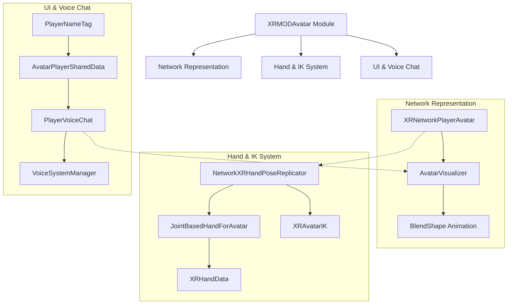

# XRMOD Avatar Module

The `XRMODAvatar` module provides a robust framework for representing and synchronizing human-like avatars in networked XR environments. It leverages Unity's Netcode for GameObjects and integrates with XR hand tracking and voice systems to create immersive social experiences.

## Key Features
- **Networked Transform Replication**: Efficiently synchronizes head and hand transforms across the network.
- **Dynamic Hand Fidelity**: Supports multiple fidelity levels for hand tracking (High, Medium, Low) to optimize bandwidth.
- **IK-Driven Body Rotation**: Automatically rotates the avatar's torso to follow head orientation for more natural movements.
- **Voice-Driven Blend Shapes**: Animates avatar facial features (like mouth movement) based on real-time voice chat audio energy.
- **Billboard Name Tags**: Provides player identity visuals that always face the viewer, with integrated voice chat status indicators.
- **Input Modality Support**: Seamlessly switches between tracked hands and motion controllers.

---

## Architecture Overview

The following diagram illustrates how the core components of the `XRMODAvatar` module interact with each other and external systems.



---

## Core Components

### 1. XRNetworkPlayerAvatar
The entry point for a networked avatar. It manages the lifecycle of the avatar representation and delegates specific tasks like visualization and hand replication to other components.

### 2. NetworkXRHandPoseReplicator
The "brain" of hand tracking networking. It captures local hand poses (either from `XR Hand` or controllers) and synchronizes them using `NetworkVariable` and `NetworkList`.

### 3. JointBasedHandForAvatar
Handles the actual animation of the avatar's fingers. It can operate in two modes:
- **Joint Rotation**: Precise rotation of every bone (High Fidelity).
- **Curl Approximation**: Uses a single value per finger to lerp between open and closed poses (Medium/Low Fidelity).

### 4. PlayerVoiceChat & AvatarVisualizer
`PlayerVoiceChat` monitors audio energy from the `VoiceSystemManager`. This data is consumed by `AvatarVisualizer` to drive blend shapes on the avatar's face (e.g., mouth opening when speaking).

---

## Quick Start Guide

1. **Avatar Setup**:
    - Attach `XRNetworkPlayerAvatar` to your networked player prefab.
    - Ensure `AvatarVisualizer` and `XRAvatarIK` are also present.
2. **Hand Configuration**:
    - Add `JointBasedHandForAvatar` to each hand visual.
    - Use the **Context Menu -> Setup Hand References** on the component to automatically link bone transforms.
3. **Networking**:
    - Add `NetworkXRHandPoseReplicator` to the root player object.
    - Link the left and right `JointBasedHandForAvatar` references.
4. **Voice & UI**:
    - Attach `PlayerVoiceChat` and `AvatarPlayerSharedData` to handle identity and audio synchronization.

---

## API Examples

### Switching Input Modes
You can manually switch between hands and controllers via code:

```csharp
var replicator = GetComponent<NetworkXRHandPoseReplicator>();
// Switch to motion controllers (automatically sets low fidelity for efficiency)
replicator.ChangeControllerType(XRInputModalityManager.InputMode.MotionController);

// Switch back to tracked hands
replicator.ChangeControllerType(XRInputModalityManager.InputMode.TrackedHand);
```

### Accessing Voice Energy
To create custom reactive visuals based on player speech:

```csharp
public float speechEnergy;
private PlayerVoiceChat voiceChat;

void Update() {
    speechEnergy = voiceChat.GetVoiceAudioEnergy; // Returns 0.0 to 1.0
}
```

---

## Pitfalls & Considerations

> [!WARNING]
> **Performance**: High-fidelity hand tracking (Level 0) synchronizes many joint rotations. Use Level 1 or 2 for large-scale sessions to conserve bandwidth.

> [!CAUTION]
> **Reentrancy**: Avoid posting notifications that trigger further state changes within the same frame in `AvatarPlayerSharedData`.

> [!NOTE]
> **Local Visibility**: By default, `XRNetworkPlayerAvatar` hides the local player's head and body to prevent camera clipping issues, while keeping hands visible for interaction.

---

## Limitations
- This module currently assumes a bipedal human avatar structure.
- IK is simplified (upper body rotation and head height) and does not include full leg or arm solvers.
