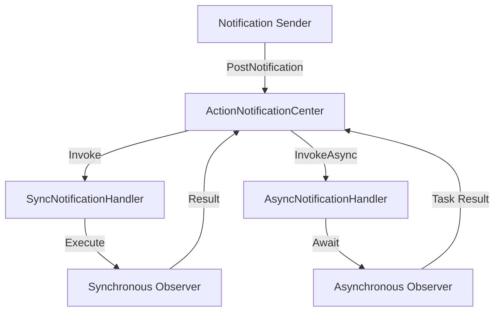

# XRMODActionNotifier

The `XRMODActionNotifier` is a robust, lightweight, and thread-safe notification system designed for Unity and the XRMOD ecosystem. It follows the observer pattern, allowing components to communicate without direct dependencies.

## Key Features
- **Flexible Observers**: Register actions or functions that return results.
- **Sync & Async Support**: Seamlessly handle both immediate and long-running tasks.
- **Result Collection**: Collect results from multiple observers in a single notification post.
- **Reentrancy Safe**: Safe to add or remove observers while a notification is being posted.

---

## Quick Start

### 1. Define Notification Data
Inherit from `BaseNotificationData` to pass custom data.

```csharp
public class UserUpdateData : BaseNotificationData
{
    public string UserName;
}
```

### 2. Register an Observer
Use `ActionNotificationCenter.DefaultCenter` to start listening for events.

```csharp
ActionNotificationCenter.DefaultCenter.AddObserver(data => 
{
    var userData = data as UserUpdateData;
    Debug.Log($"User updated: {userData.UserName}");
}, "OnUserUpdated");
```

### 3. Post a Notification
Trigger all observers listening to the event.

```csharp
ActionNotificationCenter.DefaultCenter.PostNotification("OnUserUpdated", new UserUpdateData { UserName = "JohnDoe" });
```

---

## Detailed API Examples

### Synchronous Notifications with Results
You can collect data back from your observers.

```csharp
// Observer returning a value
ActionNotificationCenter.DefaultCenter.AddObserver(data => 
{
    return "Handled by Receiver A";
}, "GetStatus");

// Posting and collecting results
List<object> results = ActionNotificationCenter.DefaultCenter.PostNotificationWithResult("GetStatus", new BaseNotificationData());

foreach (var res in results)
{
    Debug.Log(res.ToString());
}
```

### Asynchronous Notifications
Ideal for operations that require waiting (e.g., downloading assets, database calls).

```csharp
// Register an async observer
ActionNotificationCenter.DefaultCenter.AddAsyncObserver(async data => 
{
    await Task.Delay(1000);
    return "Async task finished";
}, "DownloadStarted");

// Post and await
var results = await ActionNotificationCenter.DefaultCenter.PostNotificationAsync("DownloadStarted", new BaseNotificationData());
```

---

## Important Considerations & Pitfalls

### ⚠️ Registration & Cleanup
Always balance your `AddObserver` with `RemoveObserver`. Failing to do so can lead to memory leaks and unexpected behavior, especially in Unity when objects are destroyed.

> [!IMPORTANT]
> Use `OnEnable` for registration and `OnDisable` for unregistration in MonoBehaviours.

```csharp
void OnDisable()
{
    ActionNotificationCenter.DefaultCenter.RemoveObserver("OnUserUpdated");
}
```

### ⚠️ Reentrancy
The system handles adding/removing observers during a `PostNotification` call by queuing the operations. They will be applied before the next notification is processed.

### ⚠️ Casting Notification Data
Since `BaseNotificationData` is used universally, always use safe casting (`as` or pattern matching) to avoid `InvalidCastException`.

---

## Architecture



---

## Author
Developed with ❤️ by the PhantomsXR Team.
Contact [nswell@phantomsxr.com](mailto:nswell@phantomsxr.com) for inquiries.
