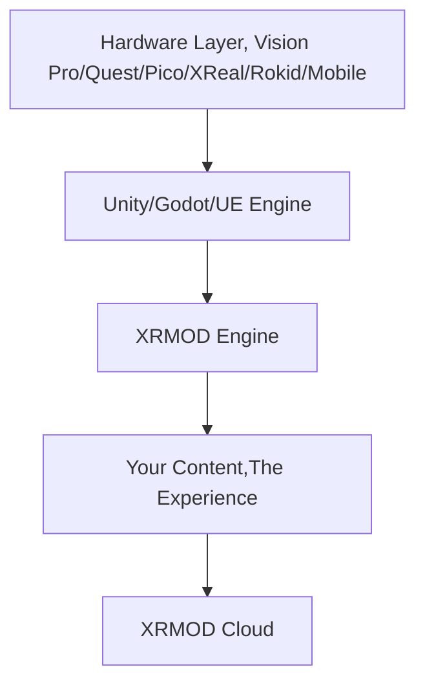

**空间计算的“无限画布” (The Infinite Canvas for Spatial Computing)**

> “我们不卖铲子，也不卖金矿。我们给你地质构造图，然后告诉你：‘去吧，这片土地是免费的，去建造你们自己的帝国。’”

# 📖 简介

XRMOD 不仅仅是一个引擎，它是空间互联网（Spatial Web）的 “隐形操作系统”（Invisible OS）。

当下的 XR 开发模式是破碎的：为了 5 分钟的体验，用户不得不下载 500MB 的应用包。这是 2010 年的模式，不是未来的模式。

XRMOD 将 Unity 的强大渲染能力与 Web 的即时性完美结合。我们致力于消灭安装包，消灭漫长的构建等待，打破应用商店的围墙。

使用 XRMOD，你不再发布 "App"，你发布的是 “体验”。用户点击，世界即刻呈现。

# 🚀 核心理念

## 杀死“应用孤岛” (即时体验)

XRMOD 是一个底层的 流转框架 (Transmission Framework)。

- 零安装 (Zero-Install): 体验像空气一样触手可及。无需下载 APK 或 IPA。
- 动态加载: 基于先进的资源流式传输架构，内容按需加载，如同浏览网页一般流畅。
- 热更新: 随时推送内容更新，告别繁琐的应用商店审核流程。

## 权力的下放 (去中心化生态)

我们拒绝围墙花园。XRMOD 是完全开源、免费的。

- 做你自己的 App Store: 部署属于你自己的内容服务器。你可以构建专属的二次元平台、企业元宇宙培训系统，或垂直行业应用。
- 类 Roblox 能力: 将 XRMOD 作为底层驱动，让你的用户在你的框架规则下创造内容。
- 拒绝“抽成”: 你拥有用户，你拥有数据，你拥有商业化的全部权利。

## 连接一切的通用语言 (一次编写，处处流转)

开发者不应在移植工作中浪费生命。XRMOD 提供了一套统一的抽象层。

- 无视平台: 无论是 Apple Vision Pro、Meta Quest 还是手机，XRMOD 负责底层的翻译与适配。
- 统一 API: 在 Unity 中只写一次逻辑，XRMOD 让它在所有支持的设备上“流转”。

## 🛠 架构概览

XRMOD 位于原生设备 SDK 与你的内容之间，充当翻译官与加载器的角色：

